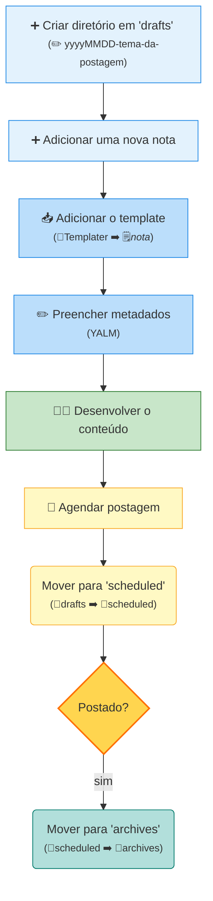

# **Repositório de conteúdos para as redes sociais**

Este repositório funciona como um **backup centralizado e organizado** de todo o conteúdo que produzo para redes sociais. Aqui você encontrará:
- ✍️ **Textos e slides** para posts
- 🔗 **Links úteis** e referências
- 📅 **Histórico de publicações**
- 💡 **Ideias e rascunhos** para conteúdo futuro

## 📂 **Estrutura**

O conteúdo está organizado nas seguintes categorias:
- /archives     → Conteúdo finalizado e publicado
- /drafts         → Rascunhos e ideias em desenvolvimento
- /scheduled  → Conteúdo finalizado e agendado para publicação
- /template    → Templates para as notas
- /theme        → CSS que customizam as notas

## 🗒 **Desenvolvimento**

Uso o Obsidian para criar e organizar postagens, com os plugins listados em [plugins-obsidian](plugins-obsidian.md). O fluxo de desenvolvimento está representado a seguir:

 
## 🤝 **Contribuições**

Sugestões e feedback são bem-vindos através das *issues*!

## 📝 **Licença**

Este conteúdo está sob licença MIT. 
Consulte o arquivo [[LICENSE]] para mais detalhes.
