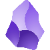
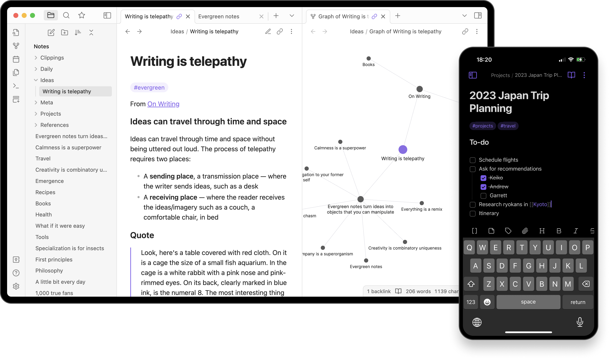
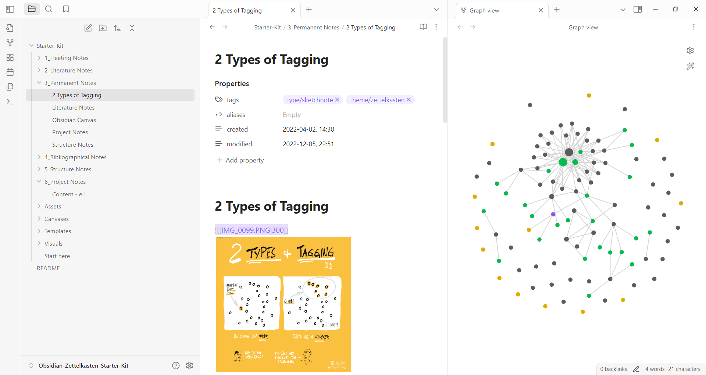
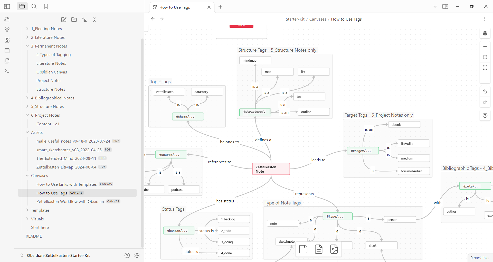
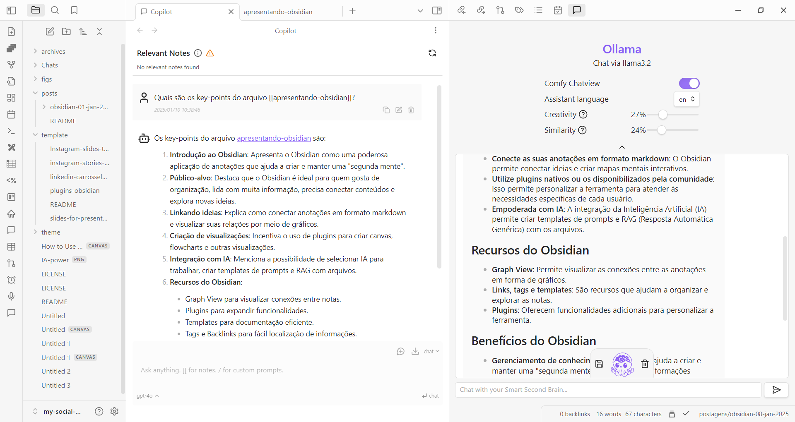
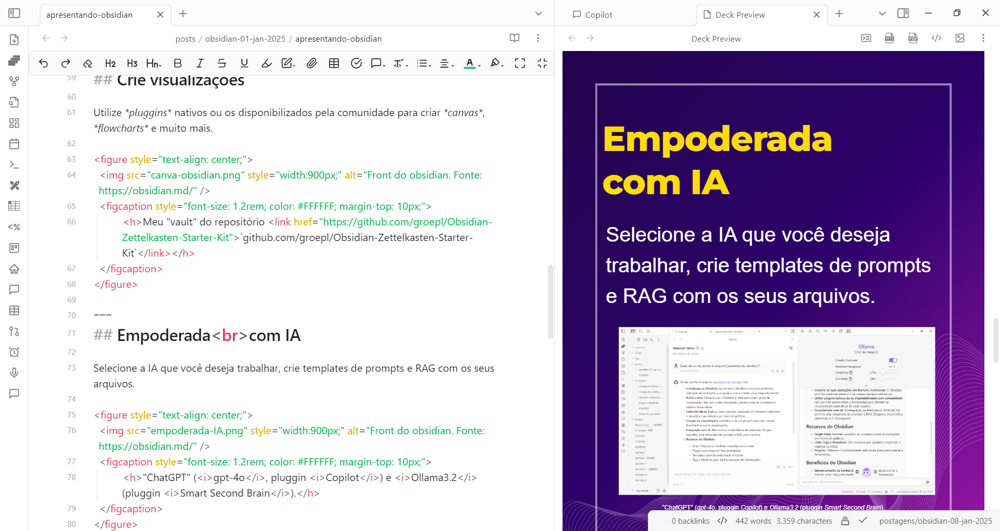

 

# Organize os seus pensamentos com o 
Obsidian

---
## O que é?

O **Obsidian** é uma poderosa aplicação de anotações que te ajuda a criar e manter uma **"segunda mente"**.

<figure style="text-align: center;">
  
  <figcaption style="font-size: 1.2rem; color: #FFFFFF; margin-top: 10px;">
	  Fonte da imagem: https://obsidian.md/
  </figcaption>
</figure>

---
# Se você...

✅ Gosta de **organização** 

✅ Lida com **muita informação**

✅ Precisa **conectar conteúdos**

✅ Vive explorando **novas ideias**

✅ Gosta de **segurança**

🫵🫵🫵

**==Então o Obsidian é para você!==**

---
## Conectanto ideias

Conecte suas anotações em formato **markdown** e visualize a relação entre elas por meio de gráficos interativos.

<figure style="text-align: center;">
  
  <figcaption style="font-size: 1.2rem; color: #FFFFFF; margin-top: 10px;">
	  <h>Meu "vault" do repositório <link href="https://github.com/groepl/Obsidian-Zettelkasten-Starter-Kit">`github.com/groepl/Obsidian-Zettelkasten-Starter-Kit`</link>.</h>
  </figcaption>
</figure>

---
## Crie visualizações

Utilize **plugins** nativos ou da comunidade para criar **canvas**, **flowcharts** e muito mais.

<figure style="text-align: center;">
  
  <figcaption style="font-size: 1.2rem; color: #FFFFFF; margin-top: 10px;">
	  <h>Meu "vault" do repositório <link href="https://github.com/groepl/Obsidian-Zettelkasten-Starter-Kit">`github.com/groepl/Obsidian-Zettelkasten-Starter-Kit`</link></h>
  </figcaption>
</figure>

---
## Empoderada com IA 

Selecione a IA que você deseja trabalhar, crie templates de prompts e integre as suas anotações usando **RAG**.

<figure style="text-align: center;">
  
  <figcaption style="font-size: 1.2rem; color: #FFFFFF; margin-top: 10px;">
	  <h>"ChatGPT" (<i>gpt-4o</i>, pluggin <i>Copilot</i>) e <i>Ollama3.2</i> (pluggin <i>Smart Second Brain</i>).</h> 
  </figcaption>
</figure>

---
## Apresentações

Produza slides usando templates personalizados (como esse carrossel) e versione tudo com o git!

<figure style="text-align: center;">
  
  <figcaption style="font-size: 1.2rem; color: #FFFFFF; margin-top: 10px;">
	  <h>Meu carrossel criado no Obsidian com o <i>pluggin</i> "<i>Marp Slide</i>".</h> 
  </figcaption>
</figure>

---

# Documentação e instalação

Você pode baixar o ==Obsidian== e consultar a documentação oficial no site da ferramenta: 

👇👇👇
### 🌐 https://obsidian.md/

---

<!-- Texto Principal -->
        

GOSTOU DO CONTEÚDO?

<!-- Linha divisória -->

<!-- Ícones de interação -->

  

    <h>❤</h>
    
curta

  

  

    <h>🗯</h>
    
comente

  

  

    <h>➥</h>
    
compartilhe

  

  

    <h>★</h>
    
salve

  

