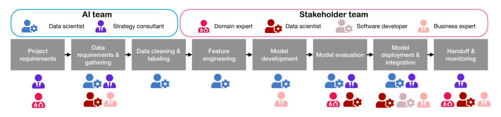

# Papers

**David, Piorkowski., Soya, Park., April, Yi, Wang., Dakuo, Wang., Michael, Muller., Felix, Portnoy. (2021). How AI Developers Overcome Communication Challenges in a Multidisciplinary Team: A Case Study.  5:1-25. doi: 10.1145/3449205**

### **Resumo**

O estudo identificou três temas principais de lacunas de comunicação enfrentadas pelos desenvolvedores de IA: 
1. Lacunas de conhecimento entre funções
2. Estabelecimento de confiança
3. Definição de expectativas

Essas lacunas geralmente exigem uma fase educacional no início dos projetos para superar as diferenças e estabelecer as bases para a colaboração. 

Os desenvolvedores de IA geralmente precisam educar as partes interessadas sobre os conceitos de IA, o que pode ser desafiador devido às diferenças de entendimento e expectativas. Por exemplo, explicar por que o desempenho de um modelo pode não melhorar com mudanças incrementais era um problema comum.

A construção de confiança é crucial e pode assumir várias formas, como reuniões regulares e esforços para explicar conceitos ou métricas do modelo. Sem confiança, é provável que surjam conflitos.

O estudo destacou a importância dos modelos mentais compartilhados (SMMs) para lidar com as lacunas de comunicação. Os SMMs ajudam a alinhar as equipes de IA e de partes interessadas, garantindo que elas trabalhem com os mesmos objetivos e entendam as funções e responsabilidades umas das outras.

Os desenvolvedores de IA usam várias estratégias para superar as lacunas de comunicação, como preparar materiais educacionais detalhados e usar espaços de informações compartilhados, como ferramentas de gerenciamento de conteúdo em nuvem, para reduzir perguntas e interrupções repetidas.

O estudo constatou que os desenvolvedores de IA têm uma influência significativa nas decisões das partes interessadas devido à sua experiência. O sucesso em projetos geralmente depende de quão bem os desenvolvedores de IA podem educar outras pessoas sobre os modelos e suas implicações.

Explicar melhor "A reatividade e a proatividade são fundamentais para gerenciar as lacunas de comunicação. A reatividade envolve responder a problemas inesperados, enquanto a proatividade envolve antecipar problemas e preparar documentação para informar os colaboradores".

O compartilhamento efetivo de conhecimento é essencial, com diferentes funções que exigem informações personalizadas. Ferramentas visuais como o PowerPoint são comumente usadas para transmitir conceitos complexos de IA de uma forma acessível a partes interessadas não técnicas.

As descobertas do estudo sugerem que os desenvolvedores de IA enfrentam desafios únicos de comunicação e desenvolveram práticas específicas para enfrentá-los. Essas práticas incluem o uso de documentação como uma ferramenta de conversação e o aproveitamento de modelos mentais compartilhados para melhorar a colaboração.

### **Estratégias para aprimorar os esforços de construção de confiança**

1. **Reuniões regulares e contatos repetidos:** Estabelecer confiança geralmente envolve uma interação consistente entre desenvolvedores de IA e partes interessadas. Reuniões regulares ajudam a criar familiaridade e compreensão, que são essenciais para a confiança.
2. **Esforços educacionais:** os desenvolvedores de IA dedicam tempo a educar as partes interessadas sobre os conceitos de IA e o processo de desenvolvimento. Essa educação ajuda as partes interessadas a entender os desafios e as contribuições dos desenvolvedores de IA, o que é crucial para criar confiança.
3. **Comunicação transparente:** fornecer explicações claras sobre o desempenho do modelo de IA e as razões por trás de determinados resultados ajuda a gerenciar expectativas e criar confiança. Por exemplo, explicar por que o desempenho de um modelo pode não melhorar apesar dos esforços pode evitar mal-entendidos e criar credibilidade 
4. **Lidando com mal-entendidos**: Quando ocorrem mal-entendidos, os desenvolvedores de IA precisam resolvê-los imediatamente. Isso envolve explicar a situação e reconciliar quaisquer diferenças de entendimento, o que ajuda a manter a confiança.
5. **Solução proativa de problemas:** Antecipar possíveis problemas e resolvê-los antes que se tornem problemas significativos pode aumentar a confiança. Ao serem proativos, os desenvolvedores de IA demonstram seu compromisso com o sucesso do projeto e sua confiabilidade como parceiros.
6. **Comunicação personalizada**: adaptar a comunicação às necessidades específicas e à compreensão das diferentes partes interessadas pode ajudar a criar confiança. Isso envolve o uso de linguagem apropriada e exemplos que ressoem com o público, tornando as informações mais acessíveis e confiáveis.
7. **Uso de ferramentas visuais:** recursos visuais, como apresentações em PowerPoint, são usados para transmitir conceitos complexos de IA de maneira simples e compreensível. Essa abordagem ajuda as partes interessadas a entender melhor as informações, promovendo a confiança na experiência e nas intenções dos desenvolvedores de IA.
8. **Construindo um modelo mental compartilhado (SMM)** : Desenvolver um entendimento comum das metas, funções e responsabilidades do projeto por meio de SMMs ajuda a alinhar a IA e as equipes de partes interessadas. Esse alinhamento é crucial para a confiança, pois garante que todos estejam trabalhando em prol dos mesmos objetivos.

### **Funções e estágios de desenvolvimento de IA**

#### Visão geral das funções da equipe de IA:
**Composition of the AI Team**

- Uma equipe de IA é um grupo de pessoas que trabalham juntas para criar e usar soluções de IA.
- Essa equipe geralmente tem dois tipos principais de pessoas: especialistas técnicos e especialistas em negócios.

#### Composição da equipe de IA:
**Components of the AI Team**

- **Especialistas técnicos:** são pessoas que sabem muito sobre computadores e como fazê-los fazer coisas inteligentes, como cientistas de dados e desenvolvedores de IA.
- **Especialistas em negócios:** são pessoas que entendêm o lado comercial, como o que a empresa precisa e como a IA pode ajudar.

#### Equipe de partes interessadas:
**Part Stakeholders Team**

- Uma equipe de partes interessadas é um grupo que pede ajuda à equipe de IA.
- Eles são especialistas em suas próprias áreas, como saúde ou finanças, mas não sabem muito sobre IA ou aprendizado de máquina (ML).

#### Exemplo: Um hospital pode ser uma equipe de partes interessadas que deseja usar a IA para prever doenças de pacientes, mas precisa da equipe de IA para criar o sistema.

#### Estágios do fluxo de trabalho de IA:
**Workflow of AI Development**

- **Processo linear versus iterativo:** os estágios do desenvolvimento da IA são mostrados em linha reta, como as etapas 1, 2, 3 etc.
- **Verificação da realidade:** na vida real, esses estágios nem sempre estão em linha reta. Eles geralmente vão e voltam, como um loop. Isso é chamado de processo iterativo.

#### Exemplo: se a equipe de IA encontrar um erro na etapa 3, ela pode voltar à etapa 1 para corri-gi-lo.

- **Estágios do desenvolvimento da IA:** É importante ter este fluxo de trabalho no desenvolvimento de uma IA.
    - **Etapa de consulta**: A equipe de IA conversa com a equipe de partes interessadas para entender o que elas precisam.
    - **Estágio de implementação**: A equipe de IA cria a solução de IA com base no que eles aprenderam na consulta.
    - **Estágio de feedback**: Após a construção, a equipe de IA mostra a solução para a equipe de partes interessadas para ver se ela atende às suas necessidades.
    - **Estágio de melhoria**: Se a equipe de partes interessadas quiser mudanças, a equipe de IA fará melhorias. Isso pode significar voltar aos estágios anteriores.
- **Desafios na comunicação:**
  - **Lacuna de conhecimento:** Muitas vezes, há uma lacuna no entendimento entre a equipe de IA e a equipe de partes interessadas.
  - **Conhecimento de IA**: A equipe de IA sabe muito sobre IA e ML.
  - **Conhecimento de domínio**: A equipe de partes interessadas sabe muito sobre seu campo específico, como medicina ou bancos.
  - **Exemplo:** Um médico pode saber como as doenças funcionam, mas não como a IA pode predizê-las.
  - **Importância da comunicação**: Uma boa comunicação é crucial para garantir que as duas equipes se entendam. A equipe de IA precisa explicar os conceitos de IA em termos simples para que a equipe de partes interessadas possa entender.

#### Conclusão: 
- **Trabalho em equipe e iteração:** projetos de IA bem-sucedidos exigem trabalho em equipe entre a equipe de IA e a equipe de partes interessadas.
- O processo geralmente é iterativo, o que significa que envolve a repetição de etapas para melhorar a solução.
- **Objetivo**: o objetivo final é criar uma solução de IA que atenda às necessidades da equipe de partes interessadas de forma eficaz.](<### **Funções e estágios de desenvolvimento de IA**

### **Explicação da reatividade e proatividade no gerenciamento de lacunas de comunicação**

- **Reatividade definida**: A reatividade se refere à capacidade de responder a problemas inesperados à medida que eles surgem. No contexto do desenvolvimento da IA, isso significa ser capaz de resolver rapidamente questões como explicar por que um modelo está com baixo desempenho ou por que certas previsões podem não atender às expectativas das partes interessadas. Isso envolve decifrar as possíveis causas dos problemas e preparar abordagens alternativas para futuras iterações **[**1**]**.
    
- **Proatividade definida**: A proatividade envolve antecipar possíveis problemas antes que eles ocorram e tomar medidas para evitá-los. Isso pode incluir a preparação de documentação que informe os membros da equipe sobre o modelo de IA e suas funcionalidades. Ao fazer isso, os desenvolvedores de IA podem preencher a lacuna de conhecimento entre eles e as partes interessadas, garantindo que todos estejam na mesma página desde o início **[**1**]**.
    
- **Importância da reatividade**: A reatividade é crucial porque permite que as equipes gerenciem mudanças e desafios inesperados de forma eficaz. Por exemplo, quando as partes interessadas não têm certeza sobre o desempenho de um modelo, os desenvolvedores de IA precisam reagir fornecendo explicações e possíveis soluções. Isso ajuda a manter a confiança e mantém o projeto em andamento, apesar de problemas imprevistos **[**1**]**.
    
- **Importância da proatividade**: A proatividade é importante porque ajuda a evitar mal-entendidos e falhas de comunicação antes que eles aconteçam. Ao antecipar perguntas e preocupações, os desenvolvedores de IA podem preparar materiais educacionais e documentação que esclareçam conceitos complexos de IA para as partes interessadas. Essa abordagem proativa ajuda a estabelecer expectativas claras e a criar confiança desde o início **[**1**]**.
    
- **Equilibrando as duas abordagens**: A comunicação bem-sucedida no desenvolvimento da IA exige um equilíbrio entre reatividade e proatividade. Embora a reatividade garanta que os problemas imediatos sejam resolvidos, a proatividade estabelece as bases para uma colaboração mais suave, reduzindo a probabilidade de tais problemas surgirem em primeiro lugar **[**1**]**.
    
- **Documentação como ferramenta proativa**: A documentação serve como uma ferramenta proativa ao capturar informações essenciais sobre o modelo de IA e sua aplicação. Essa documentação pode ser revisada e atualizada conforme necessário, fornecendo um recurso confiável para os desenvolvedores de IA e as partes interessadas consultarem durante todo o ciclo de vida do projeto **[**1**]**.
    

Ao compreender e implementar estratégias reativas e proativas, as equipes de IA podem gerenciar com eficácia as lacunas de comunicação e aprimorar a colaboração com as partes interessadas.